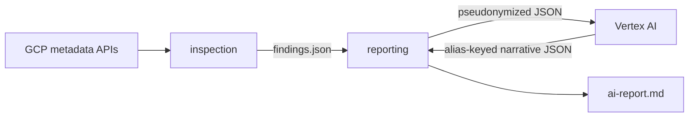

# Bounded-context map

| Context | Purpose | Depends on |
|---------|---------|------------|
| `inspection` | Collect metadata and decide CHK-01..CHK-11 deterministically | read-only GCP APIs |
| `reporting` | Validate the inspection artifact and render an advisory narrative | serialized artifact; Vertex AI through an application port |

The contexts share no Python internals. Reporting consumes the serialized public artifact,
removes observed values, replaces identifiers with aliases, and restores local identifiers
only while rendering Markdown. Provider failure cannot alter inspection artifacts.
