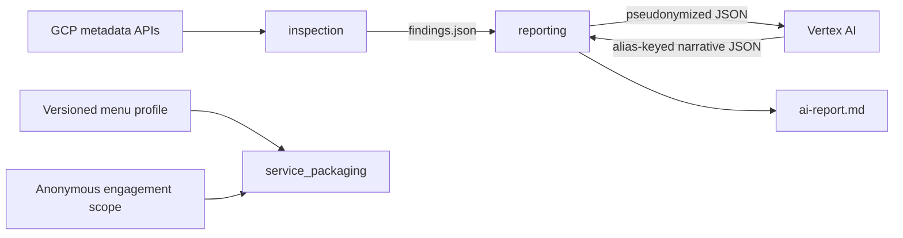

# モジュール構成

この文書は、Python実装のbounded contextと依存方向を示します。外部システムを含む全体構成は
[システム全体像](system-overview.md)を参照してください。

```mermaid
flowchart LR
  GCP["GCP metadata APIs"] --> I["inspection"]
  I -->|"findings.json"| R["reporting"]
  R -->|"pseudonymized JSON"| V["Vertex AI"]
  V -->|"alias-keyed narrative JSON"| R
  R --> M["ai-report.md"]
  MP["Versioned menu profile"] --> S["service_packaging"]
  ES["Anonymous engagement scope"] --> S
```

| Context | 役割 | 依存先 |
|---------|------|--------|
| `inspection` | メタデータを収集し、CHK-01〜CHK-13を決定論で判定する | 読み取り専用GCP API |
| `reporting` | 点検成果物を検証し、任意の説明草案を生成する | serialized artifact、application port経由のVertex AI |
| `service_packaging` | profileを検証し、顧客向けメニューと匿名スコープ適合判定を生成する | version管理profileと提案前scope入力 |

各contextはPython内部実装を共有しません。`reporting`はserialized artifactを読み、観測値を
除外して識別子をaliasへ置換し、Markdown生成時だけローカル識別子を復元します。AI providerの
失敗は点検成果物を変更しません。`service_packaging`は他contextをimportせず、cloud APIやAIを
呼び出しません。
