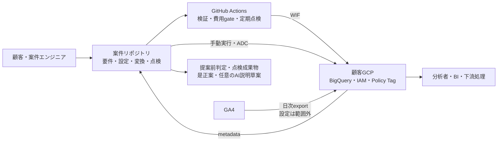
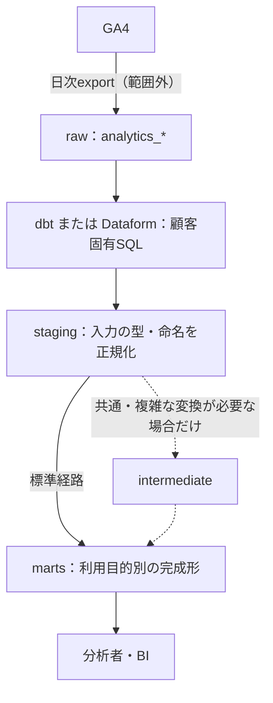
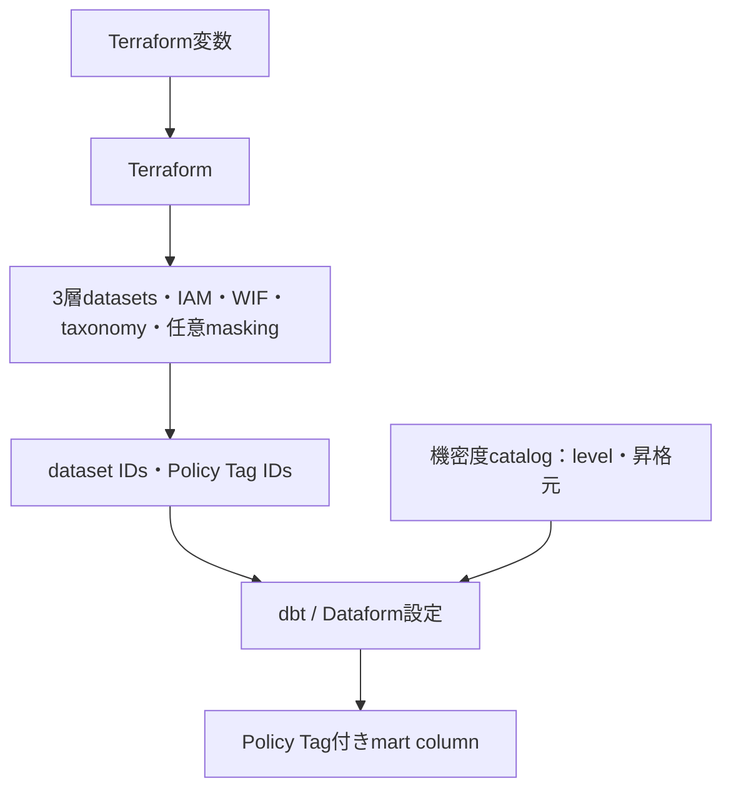
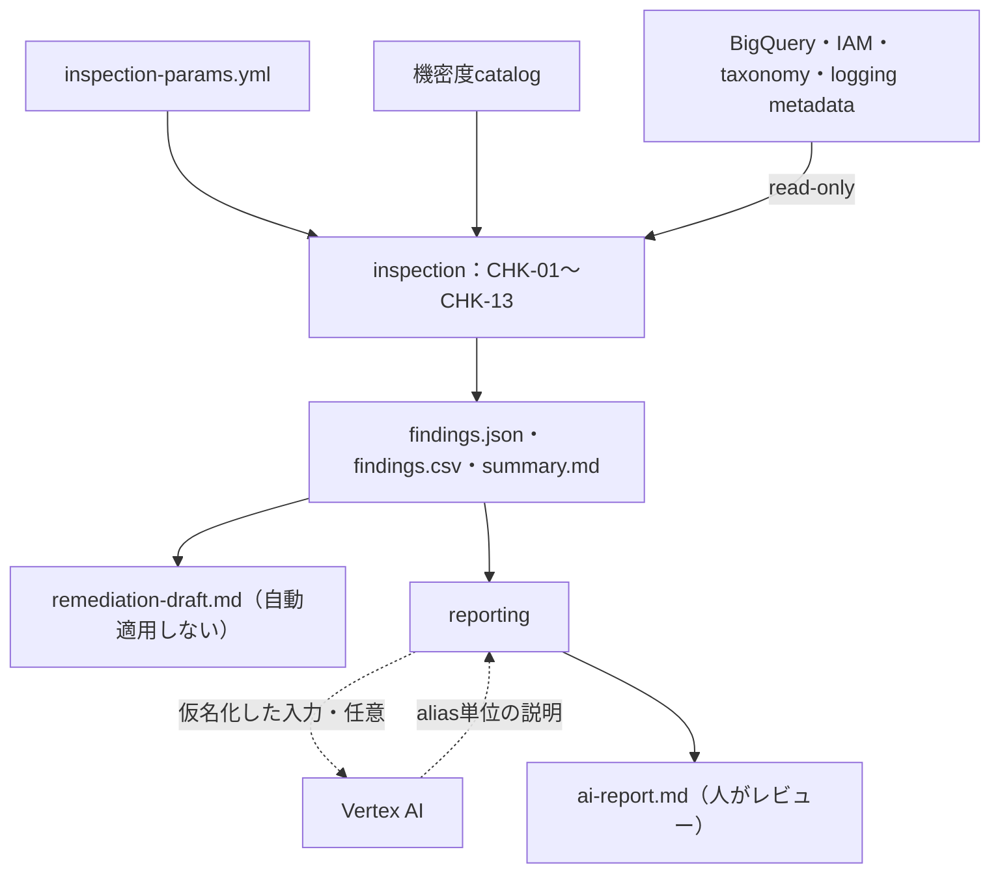
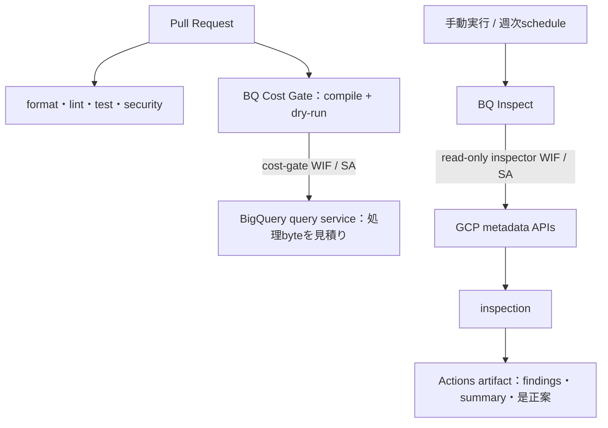

# システム全体像

この文書は、`secure-ga4-bq-template`で提供する機能、外部システムとの境界、主要な
データフローを説明します。点検の判定条件は[点検ガイド](../inspection.md)、顧客へ確認する
実装入力は[顧客要件と実装パラメータ](../requirements/customer-inputs.md)、正式な要求は
[要件索引](../requirements/README.md)を参照してください。

実際の操作順は[利用ガイド](../usage.md)を参照してください。

## 提供機能

このリポジトリは、GA4からBigQueryへエクスポート済みのデータを使う**マート層**について、
構築・点検・継続運用を案件ごとに再利用するテンプレートです。

| 利用場面 | できること | 主な入力 | 主な成果物・効果 |
|----------|------------|----------|------------------|
| 提案前 | 標準点検メニューを生成し、匿名の規模情報から標準範囲か別見積りかを判定する | project・dataset・table/view・leaf列の件数、特別作業の要否 | `inspection-menu.md`、`qualification.json`、`qualification.md` |
| 既存環境の点検 | IAM、Policy Tag、監査ログ、費用設定、保持、description、昇格列宣言をCHK-01〜CHK-13で読み取り専用点検する | `inspection-params.yml`、機密度カタログ、ADCまたはWIF | `findings.json`、`findings.csv`、`summary.md` |
| 是正検討 | findingごとの固定レシピと、任意のVertex AI説明草案を作る | 完全な`findings.json`、AI利用承認 | 自動適用しない`remediation-draft.md`、人がレビューする`ai-report.md` |
| 新規・再構築 | 3層dataset、Policy Tag、IAM/WIFをTerraformで構成し、dbtまたはDataformでマートを構築する | Terraform変数、変換設定、マートSQL、機密度カタログ | レビュー可能なIaC・変換定義、列保護、最小権限境界 |
| 継続運用 | 週次の読み取り専用点検と、PRごとのBigQuery dry-run費用gateを実行する | GitHub変数、WIF、SQL glob、byte予算 | 点検成果物、予算超過時に失敗するCI check |
| 条件付きオプション | Policy Tagに連動したBigQuery列マスキングを構成する | mask方式、対象機密度、masked reader | cleartext・masked・deniedのアクセス境界 |

このテンプレートの判定は決定論的なルールが行います。AIは任意の説明草案だけを担当し、
点検結果を書き換えたり、是正を自動適用したりしません。

## 全体アーキテクチャ

最初の図は、システム境界と主要な入出力だけを示します。内部の処理は後続の4図で視点別に
拡大します。

この図は、案件リポジトリが顧客要件を実装と点検へ変換し、GitHub ActionsからはWIF、
手動実行ではADCで顧客GCPへ接続する境界を示します。GA4の日次exportは外部前提であり、
点検成果物は顧客GCPへ自動適用されません。

### 構築モード：データをマートへ変換する

GA4の日次exportで作られたrawデータを、dbt/Dataformが利用目的別のマートへ変換します。
`staging`はraw固有のnested構造、型、命名を吸収する標準層です。`intermediate`モデルは
複数マートで共有する計算や複雑な結合を分離するときだけ追加し、単純な案件では
`staging`から`marts`へ直接進みます。現行v2のTerraformが3つのdatasetを予約することは、
3層すべてにモデルを作る要件を意味しません。テンプレートが変換レールとサンプルを提供し、
マートの指標・粒度・SQLは顧客固有実装です。

### 構築モード：基盤と列保護を変換設定へ接続する

Terraformはデータを格納する境界、identity、列保護resourceを作り、その出力を変換設定へ
渡します。catalogはTerraformを直接生成せず、変換定義とtaxonomy levelの整合をレビュー
可能にします。

### 点検・レポートモード：設定を読み、判断材料を作る

通常点検が読むのはmetadataだけであり、行値やquery結果は取得しません。`findings.json`が
決定論的な正準結果です。是正案とAIレポートは人が確認する草案で、点検結果の変更や
Terraform applyを行いません。

### GitHub Actions：変更時と定期実行を分離する

Pull Request経路は変更の品質とSQL費用上限を確認し、点検経路は読み取り専用identityで
手動または週次実行します。deployer、cost gate、inspectorのidentityを兼用しません。

### 図の読み分け

| 知りたいこと | 読む図・文書 |
|--------------|--------------|
| 誰がどのシステム境界へ接続するか | 「全体アーキテクチャ」 |
| rawからマートへどう変換するか | 「2.1 構築モード：データ変換」 |
| dataset、IAM、Policy Tagをどう接続するか | 「2.2 構築モード：基盤と列保護」 |
| CHKとレポートが何を読み、何を出すか | 「2.3 点検・レポートモード」 |
| PR・週次実行・WIF identityをどう分けるか | 「2.4 GitHub Actions」 |
| 提案前のメニューと匿名適合判定 | [顧客要件と実装パラメータ](../requirements/customer-inputs.md#提案前の匿名スコープ) |
| Python内部のmodule境界 | [モジュール構成](modules.md) |
| 認証・GitHub変数・実行時設定 | [実行時設定](../deployment/configuration.md) |

すべての点検成果物はInternalであり、公開リポジトリへcommitしません。

## 関連文書

- [点検ガイド](../inspection.md): 13項目、成果物、重大度、対象外
- [顧客要件と実装パラメータ](../requirements/customer-inputs.md): 顧客への質問と設定先
- [要件索引](../requirements/README.md): 正式な要件文書
- [モジュール構成](modules.md): Python内部のbounded context
