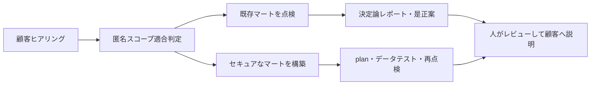

# できることと顧客案件の要件定義ガイド

この文書は、`secure-ga4-bq-template`で提供できる成果と、顧客への確認事項をどの設定値・
実装差分・承認事項へ反映するかを定義します。正式な製品要件は
[要件索引](requirements/README.md)、実行手順は[利用ガイド](usage.md)を正本とします。

## 1. 結論

このリポジトリは、GA4からBigQueryへエクスポート済みのデータを使う**マート層**について、
次の作業を案件ごとに再利用するテンプレートです。

1. セキュアなマート基盤をTerraformとdbtまたはDataformで構築する。
2. 既存マートを読み取り専用で13項目点検し、決定論的なレポートを作る。
3. 是正案と任意のAI説明草案を作る。ただし、自動適用はしない。
4. 匿名の規模情報から、標準点検メニュー内か別見積りかを事前判定する。

## 2. 提供できること

| 利用場面 | 提供する機能 | 主な入力 | 主な成果物・効果 |
|----------|--------------|----------|------------------|
| 提案前 | 標準点検メニュー生成と匿名スコープ適合判定 | プロジェクト・データセット・テーブル・leaf列の件数、特別作業の要否 | `inspection-menu.md`、`qualification.json`、`qualification.md` |
| 既存環境の点検 | IAM、Policy Tag、監査ログ、費用設定、保持、description、昇格列宣言のCHK-01〜CHK-13 | `inspection-params.yml`、機密度カタログ、読み取り専用ADC/WIF | `findings.json`、`findings.csv`、`summary.md` |
| 是正検討 | findingごとの固定レシピと任意のVertex AI説明 | 完全な`findings.json`、AI利用承認 | 非適用の`remediation-draft.md`、人がレビューする`ai-report.md` |
| 新規・再構築 | 3層データセット、Policy Tag、IAM/WIF、dbtまたはDataformのマート構築レール | Terraform変数、変換エンジン設定、マートSQL、機密度カタログ | review可能なIaC・変換定義、列保護、最小権限境界 |
| 継続運用 | 週次の読み取り専用点検とPR単位のBigQuery dry-run費用gate | GitHub変数、WIF、SQL glob、バイト予算 | 点検成果物、予算超過時に失敗するPR check |
| 条件付きオプション | Policy Tagに連動したBigQuery列マスキング | mask方式、対象機密度、masked reader | cleartext・masked・deniedのアクセス境界 |

点検項目とレポート例は
[BigQueryセキュリティ点検の内容・効果・レポート](inspection-capabilities.md)を参照してください。

## 3. このテンプレートだけでは完了しないこと

| 項目 | 現在の境界 | 案件で必要な対応 |
|------|------------|------------------|
| GA4の日次BigQueryエクスポート設定 | 対象外。エクスポート済みデータを入力とする | 顧客のGA4・GCP管理者がリンクと出力先を設定する |
| マートの業務ロジック | サンプルだけを提供する | 指標、粒度、結合、更新頻度を要件化し、dbt/Dataformモデルを実装する |
| 監査ログsinkの構築 | 点検機能は実装済みだが、ルートTerraformはsinkを作成しない | 高機密範囲、出力先、保持、除外条件を決めて案件IaCへ実装する |
| row値のPII検査 | 対象外。通常点検はメタデータだけを読む | 別スコープ、データアクセス承認、費用上限、検査方式を定義する |
| 自動是正 | 対象外。是正ドラフトは適用しない | 担当者が現況と照合し、通常のPR・plan・承認経路で実装する |
| 最終的な法令適合判断 | 点検結果だけでは証明しない | 顧客の法務・セキュリティ責任者が判断する |

Row-level security、Cloud DLP、BIツールのアクセス制御、収集時のPII防止も標準範囲外です。

## 4. 要件定義の進め方

| 段階 | 顧客と決めること | 記録先 | 完了条件 |
|------|------------------|--------|----------|
| 1. 事前適合 | 匿名の規模、WIF設定・query・row値検査の要否 | `engagement-scope.yml` | 標準範囲または別見積り理由が明示される |
| 2. 目的と範囲 | 構築／点検／両方、対象project・dataset、対象外、成功条件 | 案件要件書、`inspection-params.yml` | 分母、除外理由、受け入れ責任者が承認する |
| 3. データ設計 | 変換エンジン、入力export、マート粒度、列、更新、ネスト展開、description | dbt/Dataform設定・モデル、カタログ | モデルと機密度・由来宣言がレビュー可能になる |
| 4. セキュリティ | IAM主体、列機密度、clear/masked権限、CMEK、監査範囲 | Terraform変数、カタログ、案件IaC | データ所有者とセキュリティ責任者が承認する |
| 5. 運用と費用 | WIF、実行頻度、query予算、成果物保管、AI利用、変更・削除手順 | GitHub変数、費用予算、運用手順 | 実行前承認と停止・rollback条件が揃う |
| 6. 実装と受け入れ | 設定PR、認証不要gate、plan、データテスト、再点検 | PR、plan、点検成果物 | 承認済み範囲で期待結果と残存リスクを確認する |

## 5. 顧客への確認事項と実装パラメータ

最初に次の情報を確認し、その後の詳細表で設定先を確定します。

| 顧客から確認する情報 | 要件定義で決めること | 主な反映区分 |
|----------------------|----------------------|--------------|
| マートを使う業務、利用者、必要な判断 | 粒度、指標、必要列、鮮度、成果物 | 顧客固有のモデル実装 |
| データ所有者、セキュリティ承認者、運用担当者 | IAM、例外、変更・受け入れ責任 | パラメータと承認事項 |
| 現在のGA4 export、BigQuery、dbt/Dataform、GitHub構成 | source、engine、project、dataset、移行境界 | パラメータと実装差分 |
| 扱う識別子・属性と社内分類、規制・契約上の制約 | 機密度、clear/masked、CMEK、監査範囲 | カタログとTerraform変数 |
| データ量、増加率、代表query、保持要件 | partition、cluster、期限、dry-run予算 | モデル実装と閾値 |
| 実行頻度、変更時間、成果物保管、AI利用方針 | WIF、schedule、費用上限、rollback、保管先 | runtime設定と実行前承認 |

顧客名や担当者の連絡先は実装パラメータではありません。案件管理側で保持し、
`engagement-scope.yml`や公開リポジトリへ入れません。

### 5.1 提案前に匿名で確認する情報

顧客名、project ID、dataset名は不要です。次だけを`engagement-scope.example.yml`と同じ形式で
記録し、`make qualify-inspection-scope SCOPE=<file>`で判定します。

| 顧客への質問 | 実装フィールド |
|--------------|----------------|
| 対象GCP projectはいくつか | `counts.projects` |
| 除外後のdatasetはいくつか | `counts.datasets` |
| 走査対象のtable/viewはいくつか | `counts.table_resources` |
| フラット化したleaf列はいくつか | `counts.leaf_columns` |
| 顧客環境へWIFを新設する必要があるか | `special_conditions.customer_wif_setup` |
| dry-run以外のBigQuery queryが必要か | `special_conditions.query_jobs_required` |
| 行データまたは値の検査が必要か | `special_conditions.row_value_inspection_required` |

この判定は作業範囲の入口であり、最終価格、クラウドアクセス承認、点検結果ではありません。

### 5.2 点検案件で確認する情報

| 顧客への質問 | 設定先 | 実装パラメータ |
|--------------|--------|----------------|
| どのGCP projectを点検するか | `inspection-params.yml` | `project_id` |
| 正しいBigQuery locationはどこか | 同上 | `expected_location` |
| full scanするマートdatasetの命名規則は何か | 同上 | `datasets.mart_patterns` |
| raw export datasetの命名規則は何か | 同上 | `datasets.raw_patterns` |
| 契約上・技術上の対象外は何か | 同上 | `datasets.exclude`。理由は成果物の`skipped`で確認する |
| Data Access監査を重点化するdatasetはどれか | 同上 | `audit.high_sensitivity_datasets` |
| 監査ログの許容保持上限は何日か | 同上 | `audit.retention_max_days` |
| 大規模tableと判定するbyte数はいくつか | 同上 | `thresholds.large_table_bytes` |
| 期限なしを指摘する経過日数はいくつか | 同上 | `thresholds.long_lived_days` |
| CMEKを必須にするか | 同上 | `thresholds.require_cmek` |
| どの列をhigh/medium/lowとするか | `catalog/ga4-sensitivity.yml` | `overrides`、`promoted_columns` |
| どの重大度からCIを失敗させるか | CLIまたは手動workflow | `FAIL_ON` / `fail_on`。定期実行はreport-only |

未分類datasetは安全側に倒してマート相当で点検されます。対象外は暗黙に省かず、必ず
`datasets.exclude`で宣言します。

### 5.3 構築案件で確認する情報

| 顧客への質問 | 設定・実装先 | パラメータまたは差分 |
|--------------|--------------|----------------------|
| 対象project、location、3層dataset名は何か | Terraform | `project_id`、`region`、`layer_dataset_ids` |
| taxonomy名や既存リソースとの衝突はあるか | Terraform | `taxonomy_display_name`、WIF/SA ID群 |
| layerごとに誰へ何のBigQuery roleを付けるか | Terraform | `layer_iam_members` |
| high/medium/low列のcleartext閲覧者は誰か | Terraform | `fine_grained_readers` |
| 列maskingが必要か。方式と閲覧者は誰か | Terraform | `data_policies`。既定は空で無効 |
| GitHub Actionsを許可する案件repoはどれか | Terraform | `github_repository`、`github_repository_id` |
| dbtとDataformのどちらを使うか | `profiles/` | どちらか一方を選び、対応profileを有効化する |
| GA4 exportのproject/datasetは何か | 変換profile | `ga4_export_project`、`ga4_export_dataset` |
| 各層のdataset IDとPolicy Tagは何か | 変換profile | Terraformの`dataset_ids`、`policy_tag_ids`出力を接続する |
| どのnested keyをどの型・列名へ昇格するか | 変換SQLとcatalog | SQL実装と`promoted_columns.<column>.source`を同じPRで更新する |
| マートの粒度、指標、partition、cluster、descriptionは何か | dbt/Dataformモデル | 顧客要件に基づくモデル実装。単一の共通YAMLではない |
| 監査ログの出力先、保持、除外条件は何か | 案件Terraform | 現在のrootに直接パラメータはなく、案件IaCとして追加する |

`deployer_roles`を広げる場合は、必要な操作から権限を導出して個別レビューします。既存defaultを
理由なく追加・変更しません。

### 5.4 CI、費用、レポートで確認する情報

| 顧客への質問 | 設定先 | パラメータ |
|--------------|--------|------------|
| 点検を週次実行するか | GitHub repository variables | 手動成功後に`BQ_INSPECT_ENABLED=true` |
| dry-runするSQLと標準byte上限は何か | GitHub repository variables | `BQ_COST_GATE_SQL_GLOB`、`BQ_COST_GATE_DEFAULT_MAX_BYTES` |
| SQL別の例外予算と理由はあるか | version管理YAML | `BQ_COST_GATE_BUDGETS_FILE` |
| AI説明草案を外部providerで生成してよいか | 案件承認とruntime env | `GOOGLE_CLOUD_PROJECT`、`GOOGLE_CLOUD_LOCATION`、`GA4_BQ_REPORT_MODEL` |
| AIレポートを英語・日本語のどちらにするか | `make report-ai` | `REPORT_LANGUAGE=en|ja`。既定は`en` |
| 成果物を誰がどこへ何日保管するか | 案件運用手順 | `reports/`はgit管理せず、承認済み保管先を使う |

WIF provider名やSAメールは、Terraform出力をGitHub変数へ接続します。値を手入力で複製せず、
[実行時設定](deployment/configuration.md)の対応表を使います。

## 6. 要件から設定への変換例

架空案件で次の回答を得たとします。

- 1 project、3 dataset、30 table/view、300 leaf列で、構築と点検の両方を行う
- projectは`example-analytics`、locationは`US`、変換エンジンはDataform
- sourceは`example-analytics.analytics_123456789`
- `event_params.customer_email`を`customer_email`列へ昇格し、highとしてmaskする
- `group:analysts@example.invalid`にはmask済み値だけを見せる
- 週次点検を行い、PRのSQLは1本あたり5,000,000,000 bytesを上限とする
- Vertex AI利用を承認し、顧客向け草案は日本語にする

この回答は次の差分になります。

| 反映先 | 主な値・作業 |
|--------|--------------|
| `engagement-scope.yml` | `projects: 1`、`datasets: 3`、`table_resources: 30`、`leaf_columns: 300` |
| Terraform | `project_id=example-analytics`、`region=US`、一意な`layer_dataset_ids` |
| Dataform | `defaultProject`、`defaultLocation`、`ga4_export_project`、`ga4_export_dataset`を設定 |
| 変換SQLとcatalog | typed列を実装し、`promoted_columns.customer_email.source`と`level: high`を宣言 |
| Terraform masking | high用`EMAIL_MASK`と`masked_readers`を設定し、dataset readerを別途設定 |
| `inspection-params.yml` | project、location、mart/raw pattern、catalog、承認済みthresholdを設定 |
| GitHub variables | WIF出力を接続し、`BQ_INSPECT_ENABLED`と5,000,000,000 bytesの費用gateを段階的に有効化 |
| AIレポート | 実行時に`REPORT_LANGUAGE=ja`を指定 |

この例だけでは、マートの粒度・指標・更新SQL、監査ログsink、成果物保管先は決まりません。
それらは顧客回答を追加で得て、案件実装と承認事項として確定します。

## 7. 実行前に別途承認する事項

次は設定値が決まっていても、自動的な実行許可にはなりません。

- 顧客データまたはInternalな点検成果物へアクセスする主体と保管先
- GCPリソースの作成・変更・削除、対象project、専用prefix、残存確認方法
- BigQuery queryの実行、byte上限、費用上限、課金project
- IAM付与、WIF設定、既存共有リソースへの影響
- Vertex AIへの送信と、AI草案を顧客成果物へ含めるか
- 本番変更時間、rollback条件、是正後の再点検責任者

認証情報、顧客の行データ、完全な点検成果物は公開リポジトリへcommitしません。

## 8. 要件確定の完了条件

実装を始める前に、次を満たします。

- [ ] 構築／点検／両方の選択と、標準範囲または別見積り理由が決まっている
- [ ] 対象project・dataset・table/column分母・除外理由・locationが承認されている
- [ ] マート利用者、データ所有者、デプロイ担当、点検担当の責任分界がある
- [ ] IAM主体、機密度、clear/masked境界、CMEK、監査ログ方針が承認されている
- [ ] マート粒度、必要列、昇格元、description、partition/cluster方針が決まっている
- [ ] query費用、AI利用、成果物保管、変更・削除の承認条件が決まっている
- [ ] 設定PR、credential-free gate、Terraform plan、データテスト、再点検を受け入れ手順に含めている

設定例と実行順序は[利用ガイド](usage.md)、各変数の運用境界は
[実行時設定](deployment/configuration.md)、機密度と昇格列は
[カタログガイド](../catalog/README.md)を参照してください。
