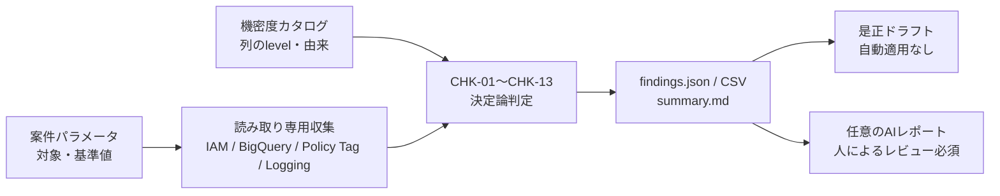

# BigQueryセキュリティ点検の内容・効果・レポート

この文書は、本システムが何を点検し、どの問題を発見でき、どのようなレポートを出すかを、
実行前に判断できる粒度で説明します。判定条件の正準は
[点検エンジン設計](requirements/design-inspection-engine.md)と実装です。

## 結論

本システムは、GA4由来に限定されない **BigQueryマート層の設定点検**です。行データを読み取らず、
次の6領域を点検します。

1. IAMの過大権限と公開設定
2. 機密列のPolicy Tagとタクソノミー
3. 監査ログの対象範囲、出力先、保持期間
4. パーティション、クラスタリング、期限による費用統制
5. データセットのロケーション、期限、暗号化方針
6. マートのdescriptionと、ネストした値から昇格した列の由来宣言

点検はGoogle CloudのメタデータAPIだけを読み、BigQueryクエリジョブを発行しません。結果は
決定論で作られ、同じスナップショット・パラメータ・カタログなら同じ指摘になります。AIは判定に使わず、
任意の説明文作成だけに使います。



## 点検対象と対象外

### 読み取る設定

| 読み取り元             | 読み取る内容                                                                                     | 主に使う点検               |
| ---------------------- | ------------------------------------------------------------------------------------------------ | -------------------------- |
| Cloud Resource Manager | プロジェクトIAM、Data Access監査設定                                                             | CHK-01〜03、06             |
| BigQuery REST API      | データセットIAM、テーブル種別・サイズ・期限・パーティション・列スキーマ・description・Policy Tag | CHK-01〜02、04〜05、07〜13 |
| Data Catalog           | タクソノミー、Policy Tag、ロケーション                                                           | CHK-05                     |
| Cloud Logging          | ログシンク、フィルタ、出力先、除外フィルタ                                                       | CHK-06〜07                 |
| 案件パラメータ         | 対象パターン、期待ロケーション、容量・日数・CMEK基準                                             | CHK-06〜11                 |
| 機密度カタログ         | 列のhigh/medium/low、昇格列の元field pathとkey                                                   | CHK-04、13                 |

### データセットの扱い

| 分類      | 判定方法                                  | 点検範囲                                              |
| --------- | ----------------------------------------- | ----------------------------------------------------- |
| MART      | `mart_patterns`に一致                     | テーブル、ビュー、leaf列まで点検                      |
| RAW       | `raw_patterns`に一致。既定は`analytics_*` | データセットIAMだけを点検し、テーブル・列は走査しない |
| EXCLUDED  | `exclude`に一致                           | 点検せず、理由付きで`skipped`へ記録                   |
| UNMATCHED | どのパターンにも一致しない                | 見落とし防止のためMARTと同じ完全点検                  |

RAWのGA4日次エクスポートは、顧客ごとの差が小さい標準スキーマを列単位で再点検するのではなく、
外部公開や過大IAMがないかを確認する封じ込め対象です。価値の中心は、加工後のマートに対する
列保護、費用統制、メタデータ整備です。

## 13の点検項目と得られる効果

### IAMと公開範囲

| ID     | 何を指摘するか                                                                              | 重大度                             | 得られる効果                                                                         |
| ------ | ------------------------------------------------------------------------------------------- | ---------------------------------- | ------------------------------------------------------------------------------------ |
| CHK-01 | プロジェクトまたはデータセットに`roles/owner`、`roles/editor`、`roles/viewer`がある         | owner/editorはHIGH、viewerはMEDIUM | 基本ロールを用途別の最小権限へ置き換える対象を特定し、変更・閲覧可能範囲を縮小できる |
| CHK-02 | `allUsers`または`allAuthenticatedUsers`へのプロジェクト・データセット権限がある             | HIGH                               | 意図しないインターネット公開や、Googleアカウント全体への公開を発見できる             |
| CHK-03 | `bigquery.dataViewer`、`dataEditor`、`dataOwner`、`admin`がプロジェクト単位で付与されている | MEDIUM                             | 必要なデータセットやテーブルだけへ権限を狭め、漏えい・誤更新時の影響範囲を限定できる |

### 列レベルセキュリティ

| ID     | 何を指摘するか                                                                    | 重大度                                  | 得られる効果                                                         |
| ------ | --------------------------------------------------------------------------------- | --------------------------------------- | -------------------------------------------------------------------- |
| CHK-04 | カタログ上high/mediumの列なのに、実テーブル列へPolicy Tagが付いていない           | high列はHIGH、medium列はMEDIUM          | モデルのビルドが成功していても列保護だけが外れている状態を発見できる |
| CHK-05 | 存在しないTag参照、Tagとデータセットのロケーション不一致、どの列にも使われないTag | 参照切れ・不一致はHIGH、未使用TagはINFO | 列アクセス制御が機能しない設定や、古いタクソノミーの残存を発見できる |

CHK-04は実テーブルだけを対象にします。BigQueryのビュー列にはPolicy Tagを付けられないため、
ビューはデータセットIAMで保護し、マートの実テーブルで列保護を行う設計です。

### 監査ログ

| ID     | 何を指摘するか                                                                                                                | 重大度                              | 得られる効果                                                           |
| ------ | ----------------------------------------------------------------------------------------------------------------------------- | ----------------------------------- | ---------------------------------------------------------------------- |
| CHK-06 | Data Accessログが全サービスに有効、BigQuery全体に有効なのに高機密データセット未指定、またはシンクが高機密範囲に絞られていない | MEDIUM                              | 必要以上のログ収集による費用と情報量を抑え、重点監査対象を明確にできる |
| CHK-07 | 有効な監査シンクがない、BigQuery出力先の保持期間が未設定・上限超過、除外フィルタがない                                        | シンク・保持はMEDIUM、除外なしはLOW | 証跡欠落、無期限保持、高頻度ノイズの取り込みを発見できる               |

GCS出力先のライフサイクルは、最小権限の点検IDでは読みません。その場合はINFOとして
「別途確認が必要」と記録し、確認できていないものを合格扱いしません。

### クエリ・保存費用

| ID     | 何を指摘するか                                                                       | 重大度                                               | 得られる効果                                                             |
| ------ | ------------------------------------------------------------------------------------ | ---------------------------------------------------- | ------------------------------------------------------------------------ |
| CHK-08 | 既定10 GiB以上の実テーブルにパーティションがない。クラスタリングがない場合も別途通知 | パーティションなしはMEDIUM、クラスタリングなしはINFO | 全量スキャンを減らす候補と、頻出フィルタに合わせた最適化候補を特定できる |
| CHK-09 | パーティション済みなのに`require_partition_filter`がfalseまたは未設定                | LOW                                                  | 利用者が期間条件を付け忘れた高額クエリを防止できる                       |
| CHK-10 | 既定90日を超える実テーブルに、テーブル期限もデータセット既定期限もない               | LOW                                                  | 一時・中間データの無期限保存を発見し、継続的な保存費を抑えられる         |

容量と日数は案件パラメータで変更できます。点検は「大きいテーブルは必ず削除する」と判断せず、
期限を付けるか永続利用の理由を記録するための候補を出します。

### データセットとメタデータの統制

| ID     | 何を指摘するか                                                              | 重大度                                                          | 得られる効果                                                                                     |
| ------ | --------------------------------------------------------------------------- | --------------------------------------------------------------- | ------------------------------------------------------------------------------------------------ |
| CHK-11 | 期待ロケーションとの不一致、データセット既定期限なし、CMEKなし              | ロケーションはMEDIUM、期限はLOW、CMEKは既定INFO・必須設定時HIGH | Policy Tagとの地域不整合、意図しない長期保存、案件の暗号化方針とのずれを発見できる               |
| CHK-12 | MART/UNMATCHEDのテーブル、ビュー、leaf列でdescriptionが未設定または空白だけ | LOW                                                             | マートの意味・利用条件・所有者をBigQuery画面やカタログ上で理解できる状態へ近づける               |
| CHK-13 | 実在する昇格列に、カタログの`source.field_path`または`source.key`がない     | LOW                                                             | `event_params`などのネスト構造から作った列の設計意図を残し、変更レビューと影響調査をしやすくする |

CHK-12はdescriptionの有無だけを確認し、文章品質や正しさは採点しません。CHK-13は構造化された
由来宣言の完全性だけを確認し、変換SQLが実際にそのキーを使うことまでは証明しません。

## 重大度の読み方

重大度はエンジンが固定ルールで付与します。対応期限そのものは案件契約に含まれないため、次は
運用上の推奨です。

| 重大度 | 推奨する扱い                                             | 代表例                                                               |
| ------ | -------------------------------------------------------- | -------------------------------------------------------------------- |
| HIGH   | 公開・本番利用前に優先して確認し、例外なら根拠を記録する | 公開IAM、owner/editor、high列のTag欠落、Tagロケーション不一致        |
| MEDIUM | 影響範囲と費用を確認して是正計画へ入れる                 | プロジェクト単位のデータ権限、監査シンクなし、大規模未パーティション |
| LOW    | ガバナンス・費用改善のバックログとして期限を決める       | partition filterなし、期限なし、descriptionなし                      |
| INFO   | 状態確認または手動確認事項として扱う                     | 未使用Tag、任意CMEKなし、GCS保持期間を確認できない                   |

## 点検結果の具体例

次は架空の`example-analytics`プロジェクトを点検した例です。実在する識別子や顧客データは
含みません。前提は次のとおりです。

- `analyst@example.invalid`にプロジェクト単位の`roles/bigquery.dataViewer`がある
- `marts.fct_events.user_id`はカタログでhighだがPolicy Tagがない
- `fct_events`は25 GiBで、パーティションとクラスタリングがない
- `fct_events.page_location`のdescriptionが空
- `sandbox`は案件パラメータで除外し、それ以外の設定は基準を満たす

この場合、少なくとも次の5件が出ます。

| ID     | 重大度 | 対象                             | 指摘                                                 |
| ------ | ------ | -------------------------------- | ---------------------------------------------------- |
| CHK-03 | MEDIUM | プロジェクト                     | BigQueryデータ閲覧権限がプロジェクト全体に付いている |
| CHK-04 | HIGH   | `marts.fct_events.user_id`       | high列にPolicy Tagがない                             |
| CHK-08 | MEDIUM | `marts.fct_events`               | 25 GiBだがパーティションがない                       |
| CHK-08 | INFO   | `marts.fct_events`               | 25 GiBだがクラスタリングがない                       |
| CHK-12 | LOW    | `marts.fct_events.page_location` | descriptionがない                                    |

### `summary.md`

人が最初に読む決定的サマリーです。対象件数、対象外、重大度別件数、各指摘の事実・期待状態・
是正ヒントが一つのMarkdownに並びます。

```markdown
# Inspection summary — example-analytics

Captured at: 2026-07-28T00:00:00+00:00

## Coverage (§4.2 denominator)

| Datasets | Tables | Columns | Skipped |
|---------:|-------:|--------:|--------:|
| 3 | 8 | 74 | 1 |

### Skipped (with reasons — nothing silently disappears)

- `projects/example-analytics/datasets/sandbox` — excluded by engagement params

## Findings by severity

- HIGH: 1
- MEDIUM: 2
- LOW: 1
- INFO: 1

## Findings by checkpoint

### CHK-04 (FR-4 #4) — 1

- [HIGH] `projects/example-analytics/datasets/marts/tables/fct_events/columns/user_id`
  — no policy tag attached (expected: policy tag level=high; fix: declare policy_tags
  in the model config)
```

「指摘ゼロ」は評価できた範囲だけの結果です。`Skipped`がある場合、そこを含めて全体合格とは
表現しません。

### `findings.json`と`findings.csv`

`findings.json`が正準の機械可読成果物です。実行パラメータ、カバレッジ、対象外理由、全指摘を
保持します。各指摘は次の固定項目を持ちます。

```json
{
  "check_id": "CHK-04",
  "severity": "HIGH",
  "resource": "projects/example-analytics/datasets/marts/tables/fct_events/columns/user_id",
  "observed": "no policy tag attached",
  "expected": "policy tag level=high (catalog: user_id -> high)",
  "rule_ref": "FR-4 #4",
  "remediation_hint": "declare policy_tags/bigqueryPolicyTags for this column in the model config"
}
```

`findings.csv`は同じ指摘一覧を表計算ソフトで扱うための投影です。パラメータ、カバレッジ、
`skipped`は含まないため、監査証跡の正準にはJSONを使います。

### `remediation-draft.md`

指摘ごとに、ローカルでバージョン管理された是正レシピを選びます。例えばCHK-04なら、
対象列名・型・Policy Tagの完全なリソース名を必須入力として列挙し、プレースホルダー付きの
schema例と検証手順を出します。

```json
{
  "name": "REPLACE_ME_COLUMN_NAME",
  "type": "REPLACE_ME_COLUMN_TYPE",
  "policyTags": {"names": ["REPLACE_ME_POLICY_TAG_RESOURCE_NAME"]}
}
```

このファイルはTerraformやモデルを変更せず、`apply`も実行しません。担当者が対象リポジトリへ
合わせ、現行GCPメタデータと案件ポリシーを照合し、レビューと承認を経て初めて是正できます。
Terraformレシピでは、これに加えてformat・validate・planを行います。

### `ai-report.md`

任意のVertex AIレポートは、経営・データ所有者向けに指摘を説明する草案です。

| セクション                     | 内容                                                          |
| ------------------------------ | ------------------------------------------------------------- |
| Executive summary              | 全体状況の短い説明                                            |
| Findingごとの説明              | 固定されたfinding参照、重大度、リソース、ルール、AIによる説明 |
| Deterministic remediation hint | 点検エンジンが出した固定の是正ヒント                          |
| Next action                    | 人が次に確認・承認する作業                                    |
| Generation metadata            | provider、model、request ID                                   |

AIへ送るのは`PROJECT`や`RESOURCE_001`のような別名、件数、check ID、重大度、承認済みの固定
ガイダンスだけです。プロジェクトID、実リソース名、観測値、行データ、認証情報、`skipped`の
詳細は送りません。AIは指摘の追加・削除・重大度変更・解決済み判定・コード生成ができません。
本文の言語は現在の契約では固定されておらず、必ず人がレビューします。

## 納品時に説明するレポート構成

顧客やデータ所有者への説明では、生成物を次の順でレビューすると判断しやすくなります。

1. **結論**: HIGH/MEDIUM件数と、公開・列保護・監査・費用の主要リスク
2. **対象範囲**: プロジェクト、基準日時、データセット・テーブル・列数、`skipped`と理由
3. **点検方法**: メタデータだけを読み、行データとクエリジョブを使っていないこと
4. **指摘詳細**: 対象、観測事実、期待状態、重大度、業務影響、是正ヒント
5. **是正計画**: 即時対応、計画対応、手動確認に分け、担当者と承認経路を決める
6. **制約**: 値検査、SQLリネージ、description品質など、今回証明していない事項
7. **添付**: 正準JSON、一覧CSV、決定的サマリー、非適用の是正ドラフト、任意のAI草案

AIレポートだけを納品根拠にはしません。`findings.json`と`summary.md`を正準とし、AI文面と
是正ドラフトを人が照合してから説明します。

## 点検によって可能になる判断

| 判断                         | レポートから分かること                                         |
| ---------------------------- | -------------------------------------------------------------- |
| すぐ対応すべきか             | HIGH/MEDIUMの件数、具体的な権限・列・データセット              |
| 点検漏れがないか             | coverage件数と、理由付き`skipped`一覧                          |
| 何を直すか                   | 観測事実、期待状態、固定の是正ヒント、是正レシピの必須入力     |
| 費用改善余地があるか         | 大規模未パーティション、filter強制なし、期限なし、監査ログ過大 |
| マートを他部門へ公開できるか | 機密列保護、IAM粒度、description、昇格列の由来宣言の不足       |
| 是正後に改善したか           | 同じパラメータで再点検し、findingsとcoverageを比較できる       |

## この点検だけでは分からないこと

- 行データ内にメールアドレスなどのPIIが混入しているか
- 集計値や変換結果が業務上正しいか
- SQLが宣言した元キーを実際に参照しているか
- descriptionの文章が正確・十分・最新か
- BigQueryビュー列にPolicy Tagが付いているか（製品仕様上、付与できない）
- RAWデータセット内の全テーブル・全列が適切か
- GCS監査ログ出力先のライフサイクルが適切か（別権限での手動確認が必要）
- 指摘を直した結果が本番へ適用済みか
- 法令・業界基準を含む最終的なコンプライアンス適合性

値検査、Cloud DLP、SQLリネージ解析、是正の自動適用は現在の点検範囲外です。必要な場合は、
対象データ、費用、権限、保管先を別途合意した作業として扱います。

## 関連文書

- [利用ガイド](usage.md): 導入、設定、実行方法
- [点検エンジン設計](requirements/design-inspection-engine.md): 正式な判定条件とデータ構造
- [AIレポートCLI契約](api/report-ai-cli.md): 入出力、認証、終了コード
- [機密度カタログ](../catalog/README.md): 列levelと昇格列の由来宣言
- [公開GA4サンプルでの技術検証](verification/2026-07-15-public-ga4-acceptance-a-evidence.md): 実行済みのカバレッジと成果物記録
