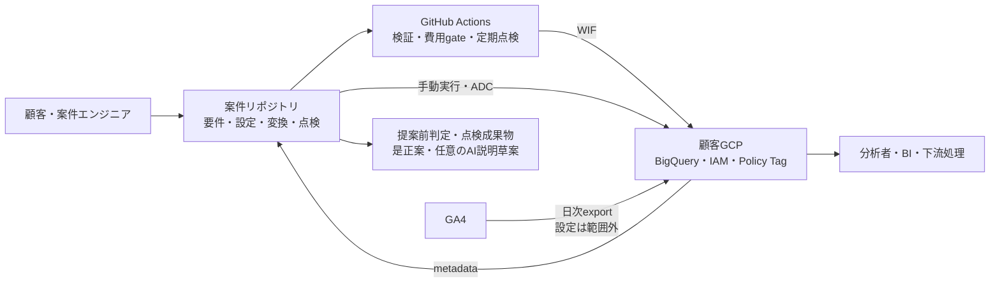
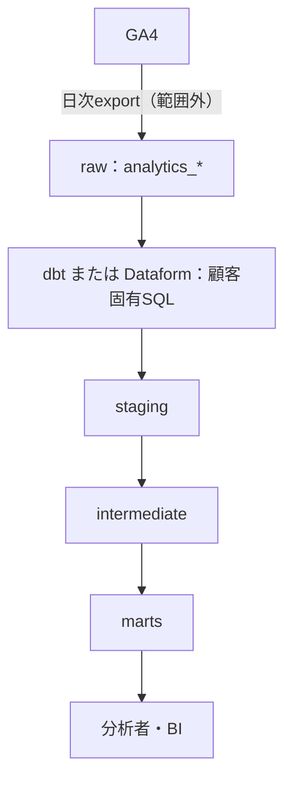
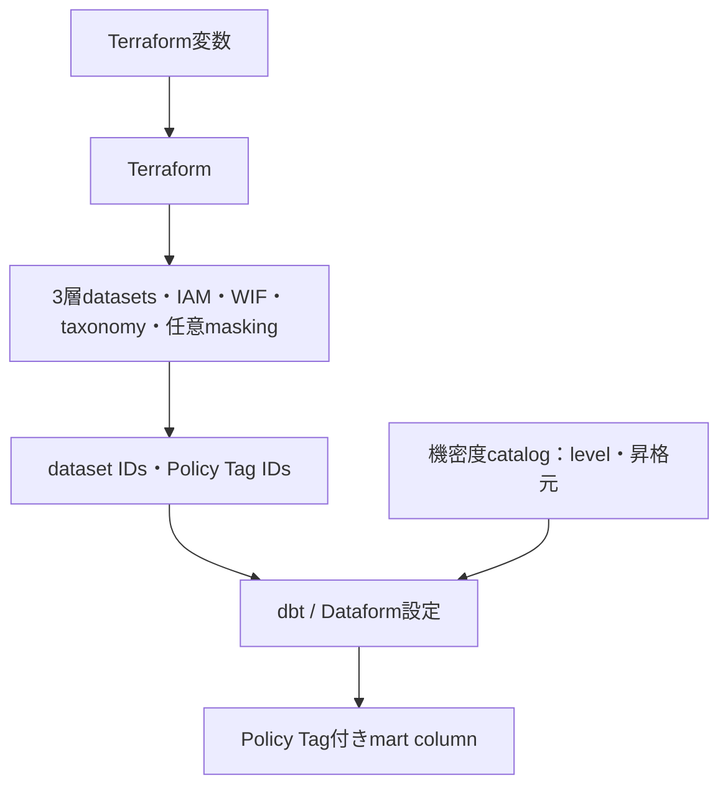
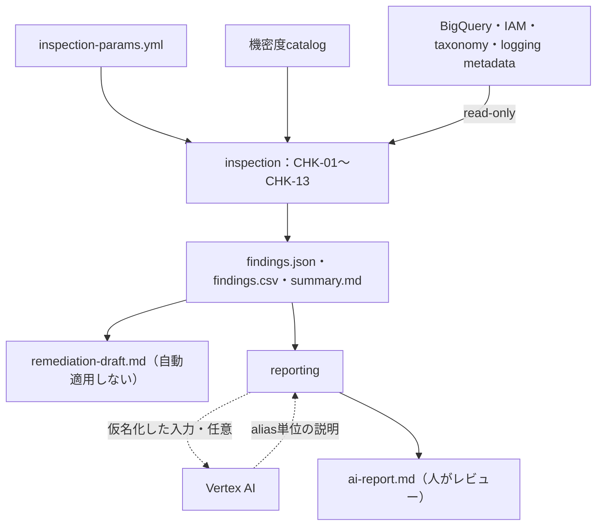
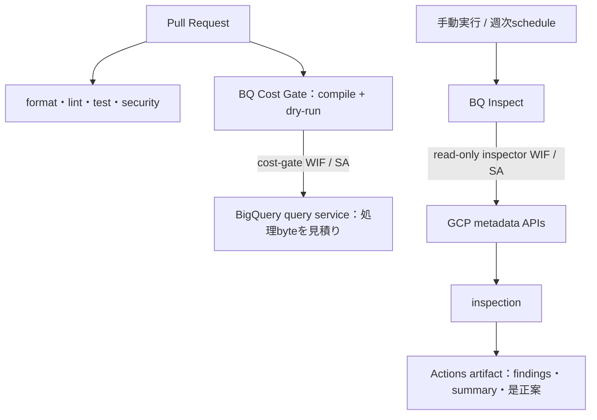

# secure-ga4-bq-template 全体像・要件索引

この文書は、初めてこのリポジトリを見る人が、**何ができるか**、**どのような構成か**、
**顧客へ何を確認して実装へ反映するか**を把握するための入口です。このページからリンクする
要件・設計文書が「何を作るか」の正本であり、`.ai/`は「どのように作業するか」の正本です。

実際の操作順は[利用ガイド](../usage.md)、13項目の検出条件とレポート例は
[点検内容・効果・レポート](../inspection-capabilities.md)を参照してください。

## 1. このリポジトリでできること

このリポジトリは、GA4からBigQueryへエクスポート済みのデータを使う**マート層**について、
構築・点検・継続運用を案件ごとに再利用するテンプレートです。

| 利用場面 | できること | 主な入力 | 主な成果物・効果 |
|----------|------------|----------|------------------|
| 提案前 | 標準点検メニューを生成し、匿名の規模情報から標準範囲か別見積りかを判定する | project・dataset・table/view・leaf列の件数、特別作業の要否 | `inspection-menu.md`、`qualification.json`、`qualification.md` |
| 既存環境の点検 | IAM、Policy Tag、監査ログ、費用設定、保持、description、昇格列宣言をCHK-01〜CHK-13で読み取り専用点検する | `inspection-params.yml`、機密度カタログ、ADCまたはWIF | `findings.json`、`findings.csv`、`summary.md` |
| 是正検討 | findingごとの固定レシピと、任意のVertex AI説明草案を作る | 完全な`findings.json`、AI利用承認 | 自動適用しない`remediation-draft.md`、人がレビューする`ai-report.md` |
| 新規・再構築 | 3層dataset、Policy Tag、IAM/WIFをTerraformで構成し、dbtまたはDataformでマートを構築する | Terraform変数、変換設定、マートSQL、機密度カタログ | レビュー可能なIaC・変換定義、列保護、最小権限境界 |
| 継続運用 | 週次の読み取り専用点検と、PRごとのBigQuery dry-run費用gateを実行する | GitHub変数、WIF、SQL glob、byte予算 | 点検成果物、予算超過時に失敗するCI check |
| 条件付きオプション | Policy Tagに連動したBigQuery列マスキングを構成する | mask方式、対象機密度、masked reader | cleartext・masked・deniedのアクセス境界 |

このテンプレートの判定は決定論的なルールが行います。AIは任意の説明草案だけを担当し、
点検結果を書き換えたり、是正を自動適用したりしません。

## 2. 全体アーキテクチャ

最初の図は、システム境界と主要な入出力だけを示します。内部の処理は後続の4図で視点別に
拡大します。

この図は、案件リポジトリが顧客要件を実装と点検へ変換し、GitHub ActionsからはWIF、
手動実行ではADCで顧客GCPへ接続する境界を示します。GA4の日次exportは外部前提であり、
点検成果物は顧客GCPへ自動適用されません。

### 2.1 構築モード：データをマートへ変換する

GA4の日次exportで作られたrawデータを、dbt/Dataformが3層へ変換します。テンプレートが
変換レールとサンプルを提供し、マートの指標・粒度・SQLは顧客固有実装です。

### 2.2 構築モード：基盤と列保護を変換設定へ接続する

Terraformはデータを格納する境界、identity、列保護resourceを作り、その出力を変換設定へ
渡します。catalogはTerraformを直接生成せず、変換定義とtaxonomy levelの整合をレビュー
可能にします。

### 2.3 点検・レポートモード：設定を読み、判断材料を作る

通常点検が読むのはmetadataだけであり、行値やquery結果は取得しません。`findings.json`が
決定論的な正準結果です。是正案とAIレポートは人が確認する草案で、点検結果の変更や
Terraform applyを行いません。

### 2.4 GitHub Actions：変更時と定期実行を分離する

Pull Request経路は変更の品質とSQL費用上限を確認し、点検経路は読み取り専用identityで
手動または週次実行します。deployer、cost gate、inspectorのidentityを兼用しません。

### 2.5 図の読み分け

| 知りたいこと | 読む図・文書 |
|--------------|--------------|
| 誰がどのシステム境界へ接続するか | 「全体アーキテクチャ」 |
| rawからマートへどう変換するか | 「2.1 構築モード：データ変換」 |
| dataset、IAM、Policy Tagをどう接続するか | 「2.2 構築モード：基盤と列保護」 |
| CHKとレポートが何を読み、何を出すか | 「2.3 点検・レポートモード」 |
| PR・週次実行・WIF identityをどう分けるか | 「2.4 GitHub Actions」 |
| 提案前のメニューと匿名適合判定 | 「4.1 提案前の匿名スコープ」 |
| Python内部のmodule境界 | [モジュール構成](../architecture/modules.md) |
| 認証・GitHub変数・実行時設定 | [実行時設定](../deployment/configuration.md) |

すべての点検成果物はInternalであり、公開リポジトリへcommitしません。

## 3. 標準実装と案件実装の境界

| 項目 | テンプレートが提供するもの | 案件で決めて実装するもの |
|------|----------------------------|--------------------------|
| GA4 export | export済みBigQuery datasetを入力として扱う契約 | 顧客のGA4・GCP管理者によるリンクと出力先設定 |
| マート | 3層構成、dbt/Dataformレール、サンプル、データテストの枠組み | 指標、粒度、結合、列、更新頻度、partition/cluster、SQL |
| 列保護 | taxonomy、Policy Tag、任意masking、機密度カタログ | 顧客分類、対象列、clear/masked reader、例外 |
| IAM/WIF | 最小権限を分離するTerraformとCI接続 | 実際の主体、repository、承認・運用責任者 |
| 監査ログ | 設定を検査するCHK | sinkの出力先、保持、除外条件と案件IaC |
| 点検 | CHK-01〜CHK-13、成果物schema、是正レシピ | 対象範囲、除外理由、閾値、保管先、受け入れ判断 |
| AIレポート | provider境界、仮名化、英語・日本語の草案生成 | AI利用承認、region/model、顧客提出前レビュー |

Row-level security、Cloud DLP、row値のPII検査、BIツール側のアクセス制御、収集時のPII防止、
自動是正、最終的な法令適合判断は標準範囲外です。必要な場合は別スコープとして、
データアクセス、費用、責任者、受け入れ条件を定義します。

## 4. 顧客要件を実装へ変換する流れ

| 段階 | 顧客と決めること | 主な記録・設定先 | 完了条件 |
|------|------------------|------------------|----------|
| 1. 事前適合 | 匿名の規模、WIF設定・query・row値検査の要否 | `engagement-scope.yml` | 標準範囲または別見積り理由が明示される |
| 2. 目的と範囲 | 構築／点検／両方、対象、対象外、成功条件 | 案件要件書、`inspection-params.yml` | 分母、除外理由、受け入れ責任者が承認する |
| 3. データ設計 | engine、入力、マート粒度、列、更新、ネスト展開、description | dbt/Dataform設定・モデル、catalog | モデルと機密度・由来宣言をレビューできる |
| 4. セキュリティ | IAM主体、列機密度、clear/masked権限、CMEK、監査範囲 | Terraform変数、catalog、案件IaC | データ所有者とセキュリティ責任者が承認する |
| 5. 運用と費用 | WIF、頻度、query予算、成果物保管、AI利用、rollback | GitHub変数、予算、運用手順 | 実行前承認と停止条件が揃う |
| 6. 実装と受け入れ | 設定PR、認証不要gate、plan、データテスト、再点検 | PR、plan、点検成果物 | 期待結果と残存リスクを確認する |

顧客名や担当者の連絡先は実装パラメータではありません。案件管理側で保持し、
`engagement-scope.yml`や公開リポジトリへ入れません。

### 4.1 提案前の匿名スコープ

顧客名、project ID、dataset名を収集せず、次の件数と作業条件だけを確認します。

| 顧客への質問 | `engagement-scope.yml`のフィールド |
|--------------|--------------------------------------|
| 対象GCP projectはいくつか | `counts.projects` |
| 除外後のdatasetはいくつか | `counts.datasets` |
| 走査対象のtable/viewはいくつか | `counts.table_resources` |
| フラット化したleaf列はいくつか | `counts.leaf_columns` |
| 顧客環境へWIFを新設する必要があるか | `special_conditions.customer_wif_setup` |
| dry-run以外のBigQuery queryが必要か | `special_conditions.query_jobs_required` |
| 行データまたは値の検査が必要か | `special_conditions.row_value_inspection_required` |

`make qualify-inspection-scope SCOPE=<file>`は、version管理された標準メニューにこの回答を照合します。
最終価格、クラウドアクセス承認、点検結果を決める処理ではありません。

### 4.2 点検パラメータ

| 顧客への質問 | 設定先・実装パラメータ |
|--------------|-------------------------|
| どのproject・locationを点検するか | `inspection-params.yml`: `project_id`、`expected_location` |
| mart/raw datasetの命名規則と明示的な対象外は何か | `datasets.mart_patterns`、`datasets.raw_patterns`、`datasets.exclude` |
| Data Access監査を重点化するdatasetはどれか | `audit.high_sensitivity_datasets` |
| 監査ログの許容保持上限は何日か | `audit.retention_max_days` |
| 大規模table・長期保持・CMEKの基準は何か | `thresholds.large_table_bytes`、`long_lived_days`、`require_cmek` |
| どの列をhigh/medium/lowとし、昇格元を何とするか | `catalog/ga4-sensitivity.yml`: `overrides`、`promoted_columns` |
| どの重大度からCIを失敗させるか | CLIまたは手動workflow: `FAIL_ON` / `fail_on`。定期実行はreport-only |

未分類datasetは安全側に倒してマート相当で点検します。対象外は暗黙に省かず、理由とともに
`datasets.exclude`へ宣言します。

### 4.3 構築パラメータと顧客固有実装

| 顧客への質問 | 設定・実装先 |
|--------------|--------------|
| project、location、3層dataset名は何か | Terraform: `project_id`、`region`、`layer_dataset_ids` |
| layerごとに誰へ何のroleを付けるか | Terraform: `layer_iam_members` |
| cleartext閲覧者、mask方式、masked readerは誰か | Terraform: `fine_grained_readers`、`data_policies`。maskingは既定で無効 |
| GitHub Actionsを許可する案件repositoryはどれか | Terraform: `github_repository`、`github_repository_id`、SA/WIF ID群 |
| dbtとDataformのどちらを使うか | `profiles/`から一方を選び、対応profileを有効化する |
| GA4 exportのproject/datasetは何か | 変換profile: `ga4_export_project`、`ga4_export_dataset` |
| nested keyをどの型・列名へ昇格するか | 変換SQLと`promoted_columns.<column>.source`を同じPRで更新する |
| マートの粒度、指標、列、更新、partition、cluster、descriptionは何か | 顧客要件に基づくdbt/Dataformモデル実装 |
| 監査ログの出力先、保持、除外条件は何か | 現在のrootに直接パラメータはないため、案件Terraformへ追加する |

`deployer_roles`を広げる場合は、必要な操作から権限を導出して個別レビューします。
既定値を根拠なく広げません。

### 4.4 CI・費用・レポート

| 顧客への質問 | 設定先・実装パラメータ |
|--------------|-------------------------|
| 点検を週次実行するか | 手動成功後にGitHub変数`BQ_INSPECT_ENABLED=true` |
| dry-run対象SQLと標準byte上限は何か | `BQ_COST_GATE_SQL_GLOB`、`BQ_COST_GATE_DEFAULT_MAX_BYTES` |
| SQL別の例外予算と理由はあるか | version管理YAMLと`BQ_COST_GATE_BUDGETS_FILE` |
| Vertex AIで説明草案を生成してよいか | 案件承認、`GOOGLE_CLOUD_PROJECT`、`GOOGLE_CLOUD_LOCATION`、`GA4_BQ_REPORT_MODEL` |
| レポート言語は何か | `make report-ai REPORT_LANGUAGE=en|ja`。既定は`en` |
| 成果物を誰がどこへ何日保管するか | 案件運用手順。`reports/`はgit管理しない |

WIF provider名やSAメールはTerraform出力をGitHub変数へ接続し、手入力で複製しません。

## 5. 要件から設定への変換例

架空案件で次の回答を得たとします。

- 1 project、3 dataset、30 table/view、300 leaf列で、構築と点検の両方を行う。
- locationは`US`、変換engineはDataform、sourceは`example-analytics.analytics_123456789`。
- `event_params.customer_email`を`customer_email`へ昇格し、highとしてmaskする。
- 分析者にはmask済み値だけを見せる。
- 週次点検を行い、PRのSQLは1本あたり5,000,000,000 bytesを上限とする。
- Vertex AI利用を承認し、顧客向け草案は日本語にする。

| 反映先 | 主な値・作業 |
|--------|--------------|
| `engagement-scope.yml` | `projects: 1`、`datasets: 3`、`table_resources: 30`、`leaf_columns: 300` |
| Terraform | project、`region=US`、一意な`layer_dataset_ids`、mask policy、masked reader |
| Dataform | source project/dataset、location、Terraformが出力するdataset・Policy Tag ID |
| 変換SQLとcatalog | typed列を実装し、`promoted_columns.customer_email.source`と`level: high`を宣言 |
| `inspection-params.yml` | project、location、mart/raw pattern、catalog、承認済みthreshold |
| GitHub variables | WIF出力、週次点検の有効化、5,000,000,000 bytesの費用gate |
| AIレポート | 実行時に`REPORT_LANGUAGE=ja` |

この回答だけでは、マートの指標・更新SQL、監査ログsink、成果物保管先は決まりません。
追加の顧客回答と承認を得て、案件実装として確定します。

## 6. 実行前に別途承認する事項

次は設定値が決まっていても、自動的な実行許可にはなりません。

- 顧客データまたはInternalな点検成果物へアクセスする主体と保管先
- GCPリソースの作成・変更・削除、対象project、専用prefix、残存確認方法
- BigQuery queryの実行、byte上限、費用上限、課金project
- IAM付与、WIF設定、既存共有リソースへの影響
- Vertex AIへの送信と、AI草案を顧客成果物へ含めるか
- 本番変更時間、rollback条件、是正後の再点検責任者

認証情報、顧客の行データ、完全な点検成果物は公開リポジトリへcommitしません。

## 7. 要件確定の完了条件

- [ ] 構築／点検／両方の選択と、標準範囲または別見積り理由が決まっている
- [ ] 対象project・dataset・table/column分母・除外理由・locationが承認されている
- [ ] マート利用者、データ所有者、デプロイ担当、点検担当の責任分界がある
- [ ] IAM主体、機密度、clear/masked境界、CMEK、監査ログ方針が承認されている
- [ ] マート粒度、必要列、昇格元、description、partition/cluster方針が決まっている
- [ ] query費用、AI利用、成果物保管、変更・削除の承認条件が決まっている
- [ ] 設定PR、認証不要gate、Terraform plan、データテスト、再点検を受け入れ手順に含めている

## 8. 要件・設計文書索引

| 文書 | 内容 | 状態 |
|------|------|------|
| [requirements-secure-asset.md](requirements-secure-asset.md) | 2モード（構築／点検）、3つの統制、機密度catalog、nested列展開、CHK-01〜CHK-13、asset統合計画 | v1.0 + CHK-12/CHK-13 |
| [requirements-dbt-dataform-rail.md](requirements-dbt-dataform-rail.md) | profile-copyによるdbt/Dataform選択、共通governance層、CI dry-run費用gate | v1.0 |
| [requirements-service-packaging.md](requirements-service-packaging.md) | 共通コア、標準点検メニュー、適合判定、3 preset、条件付きoption、価格根拠、提案草案AI | v1.2草案 |
| [design-modules-wif-wiring.md](design-modules-wif-wiring.md) | Terraform module、deployer／inspector WIF、CI workflowの接続設計 | baseline v1実装済み、費用gateはADR-0006で拡張 |
| [design-inspection-engine.md](design-inspection-engine.md) | inspection engineのmodule、snapshot、CHK-01〜CHK-13、案件parameter、CLI/report契約 | CHK-13まで実装済み |
| [design-ai-report-generator.md](design-ai-report-generator.md) | 決定論的入力、security境界、CLI/output契約、英語・日本語のAI説明草案 | 実環境v1実装済み |

### 読み方

- 要件・設計文書は日本語を正本とし、顧客要件の意味を実装都合で変更しません。
- 文中の`参照_*`、`面談準備_*`、`面談台本_*`はrepository外のHR資料であり、本要件には含みません。
- この公開repositoryには価格帯や組織的な背景を含むレビュー済み要件を置けますが、完全な点検成果物は
  SEC-011に従ってInternalとして扱います。
- 点検checkpoint、費用gate、preset判定は決定論的な処理が決め、AIはその結果の範囲内で文章だけを作ります。
